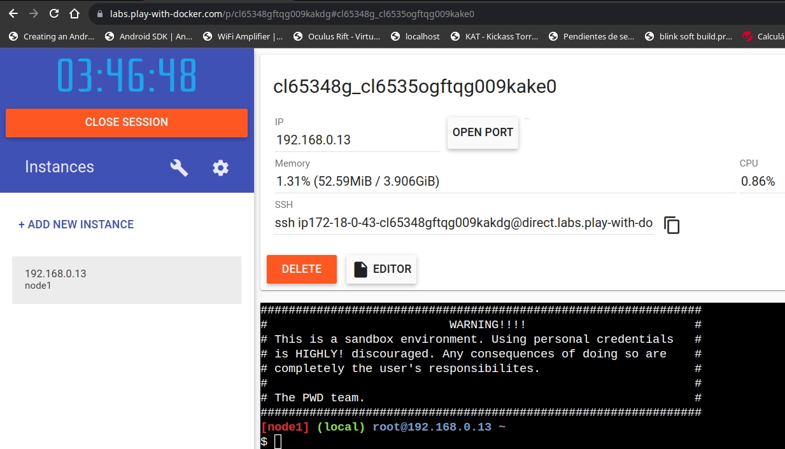
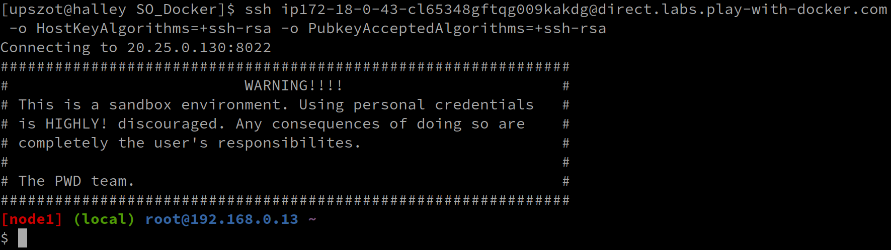

# SO_Docker

	UTN - Arquitectura y Sistemas Operativos
	El presente repo tiene la finalidad de dar una introduccion a Docker

## Precondiciones:

- Se debera tener instalado los siguientes paquetes:
		- git
		- docker
- Agregar tu usuario al grupo "docker" y luego relogearse
```sh
sudo usermod -a -G docker $(whoami)
```
- Servicio de docker corriendo 
```sh
#Pongo el servicio de docker en enable -> (Para que tras un reinicio se levante)
#Pongo el servicio de docker en runnig
sudo systemctl enable --now docker

#sudo valido el estado del servicio
sudo systemctl status docker
```


### Contendido:
 - Presentacion Introductoria
 - Carpetas de ejemplos:

| Subcarpeta 	   | Description 										|
| ------          | ------ 											|
| ejemplo0 | docker run httpbin [Metodos HTTP](https://es.wikibooks.org/wiki/M%C3%A9todos_HTTP) |
| ejemplo1 			| docker run nginx shareando carpeta 		|
| ejemplo2 			| Haciendo una imagen 							|
| ejemplo3		 	| Ejemplo de docker-compose web con php 	|


## Documentacion de referencia 

- ### Docker
  - [Instalacion de docker](https://docs.docker.com/engine/install)
  - [Registry -> docker hub](https://hub.docker.com/)
  - [CheatSheet-Docker](https://dockerlabs.collabnix.com/docker/cheatsheet)
  - [video: Pelado Nerd - Docker](https://www.youtube.com/watch?v=CV_Uf3Dq-EU&t=2867s)
- ### Kubernetes
  - [kubernetes](https://kubernetes.io/)
  - [minikube](https://minikube.sigs.k8s.io/docs/start/)
  - [video: Pelado Nerd - Kubernetes](https://www.youtube.com/watch?v=CV_Uf3Dq-EU&t=2867s)

- ### OKD (The Community Distribution of Kubernetes that powersRed Hat OpenShift)
  - [OKD](https://www.okd.io/)
 
- ### Openshift (OCP)
  - [Openshift](https://www.redhat.com/en/technologies/cloud-computing/openshift)
  - [Red Hat OpenShift Local](https://console.redhat.com/openshift/create/local)

## Test de tecnologias via web
  - [Play with Docker](https://labs.play-with-docker.com/)
  
    Si se desea conectarse a la terminal de alguna instancia por fuera de la pagina web.
    Puede ejecutar el comando ssh, desde PowerShell / [Putty](https://www.putty.org) / o terminal de linux... añadiendo los parametros descriptos abajo a la linea de ejecucion de ssh que nos otorga la web.
```sh
# -o HostKeyAlgorithms=+ssh-rsa -o PubkeyAcceptedAlgorithms=+ssh-rsa
#Ejemplo:
ssh usuario@server -o HostKeyAlgorithms=+ssh-rsa -o PubkeyAcceptedAlgorithms=+ssh-rsa
```
<div>
<table >
<td> Copiar comando ssh </td>
<td>  </td>  
<tr> </tr>
<td> Agregarle los parametros <br><br> -o HostKeyAlgorithms=+ssh-rsa <br> -o PubkeyAcceptedAlgorithms=+ssh-rsa</td>  
<td>  </td>
</table>
</div>

  - [Play with Kubernet](https://labs.play-with-k8s.com/)


  - [Play with Openshift](https://developers.redhat.com/developer-sandbox/activities/learn-kubernetes-using-red-hat-developer-sandbox-openshift)
  
  https://www.redhat.com/en/interactive-labs/red-hat-openshift-4.11-playground

 Requiere que se creen una cuenta de developer en redhat (es free)
 
