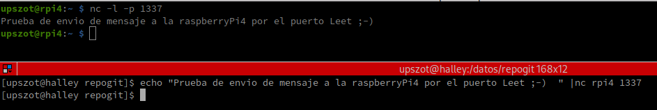
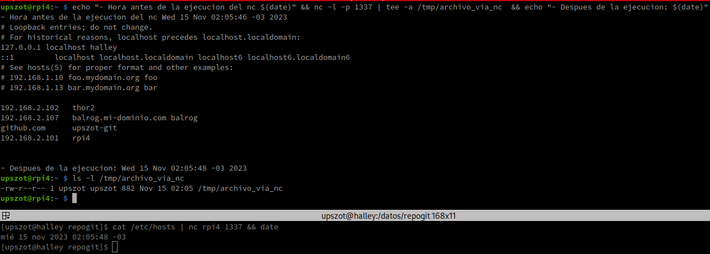

# Herramientas de redes

## Comandos para obtener o manipular Informacion de interfaces de red
 - Conocer IP del host
 ```sh
#Informacion de todas las interfaces de red
ip addr show
#Muestro solamente la informacion de la interface "wlp2s0" mi placa de red wifi
ip addr show wlp2s0
#Muestro informacion de todas las interfaces de red
nmcli -p device show
#Muestro todas las IP del equipo
hostname -I
#Parecido al ipconfig de windows,Requiere instalacion del paquete "net-tools"
ifconfig
 ```
  - Conocer mi IP Publica
 ```sh
curl ifconfig.me
 ```  


 ## Deteccion de puertos Abiertos
 - [netstat](https://es.wikipedia.org/wiki/Netstat) 
 ```sh
#Para saber si el puerto del protocolo de ssh esta abierto y/o tiene conecciones activas, etc
sudo netstat -putona |grep ":22" 
#Muestro Todas las conecciones en estado Listening de los puertos TCP y UDP, IP, PID, programas asociados 
sudo netstat -punlop   
 ```
 - [nc](https://es.wikipedia.org/wiki/Netcat)  
 ```sh
#Comando netcat - Verifico si el puerto 22 del equipo remoto esta abierto
nc -zv localhost 22
 ```
 - [telnet](https://es.wikipedia.org/wiki/Telnet) 
 ```sh
telnet localhost 22
 ```
 - [nmap](https://blog.elhacker.net/2021/10/chuleta-comandos-nmap-opciones-nse.html) 
 ```sh
 #realiza un escaneo basico en el puerto 22 del host1
sudo nmap -p 22 host1
#realiza un escaneo de tipo TCP ACK en el puerto 22 del host1
sudo nmap -PA -p 22 host1
#realiza un escaneo de tipo TCP SYN en el puerto 22 del host1
sudo nmap -PS -p 22 host1
 ```
- [ss](https://linux.die.net/man/8/ss) 
 ```sh
 ss -putona |grep ":22"  #Lo mismo que el netstat, solo que no requiere de sudo... y con un comando moderno.
 ```
## Jugando con las conecciones...

### nc (netcat)
##### Una forma rapida de verificar si tengo habilitacion de trafico de red entre 2 equipos.
- En el Host1, Abro el puerto 1337 en modo Listened 
 ```sh
 nc -l -p 1337
 ```  
- En el Host2, redirecciono un texto hacia el comando nc <host1> <puerto>
 ```sh
 echo "Prueba de envio de mensaje a la raspberryPi4 por el puerto Leet ;-)  " |nc rpi4 1337
 ```
<div>
<table>
 
</table>
</div>


##### Tambien podria enviar un archivo sin necesidad de recurrir a un scp (copy por ssh)
- En el Host1, abro el puerto deseado y redirecciono la salida al comando tee en modo append para que me mueste por pantalla y me escriba el archivo
 ```sh
 nc -l -p 1337  | tee -a /tmp/archivo_via_nc
 ```    
- En el Host2, envio la salida de un cat hacia el comando nc <host1> <puerto>
 ```sh
 cat /etc/hosts  |nc rpi4 1337
 ```
<div>
<table>
 
</table>
</div>
